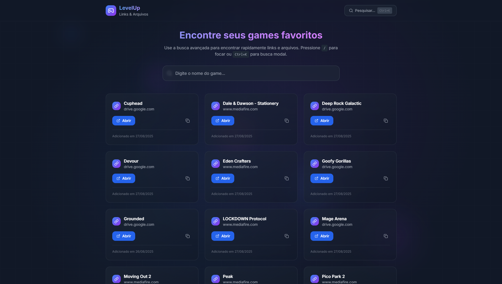

# 🎮 Games Links



Catálogo leve e responsivo com **links de jogos on-line**, organizado por categorias e plataformas. Inclui busca e filtros para achar rapidamente o que jogar.

🔗 **Live/Demo:** veja o link em **About → Website** do repositório 

🧰 **Stack:** Next.js · React · TypeScript · Tailwind CSS · (opcional) Sanity CMS

---

## ✨ Recursos
- 🔎 **Busca** + **filtros** por tags/plataformas
- ⚡ Páginas rápidas (Next.js / SSG)
- 📱 **Responsivo** e acessível
- 🗂️ (Opcional) conteúdo gerenciado via **Sanity**

## 🚀 Como rodar localmente
Requisitos: **Node 18+** e **npm** (ou pnpm/yarn)

```bash
npm install
npm run dev
# http://localhost:3000

```

## ⚙️ Variáveis de ambiente (Sanity — opcional)

Se você utilizar Sanity, crie um `.env.local` com:

```bash
SANITY_PROJECT_ID=...
SANITY_DATASET=production
SANITY_API_VERSION=2023-10-01

```

## 🛠️ Scripts úteis

- `dev` – desenvolvimento
- `build` – build de produção
- `start` – servir o build (quando aplicável)
- `lint` – (se configurado) checagens de lint

## ☁️ Deploy

- **Vercel** recomendado (detecta Next.js automaticamente).
- Configure variáveis de ambiente do Sanity no painel do provedor (se usar CMS).


## 📄 Licença

MIT — veja o arquivo `LICENSE` (ajuste se sua licença for diferente).

## 🤝 Contribuindo

1. Faça um fork
2. Crie uma branch: `git checkout -b feat/minha-feature`
3. Commit: `git commit -m "feat: minha feature"`
4. Push: `git push origin feat/minha-feature`
5. Abra um PR
